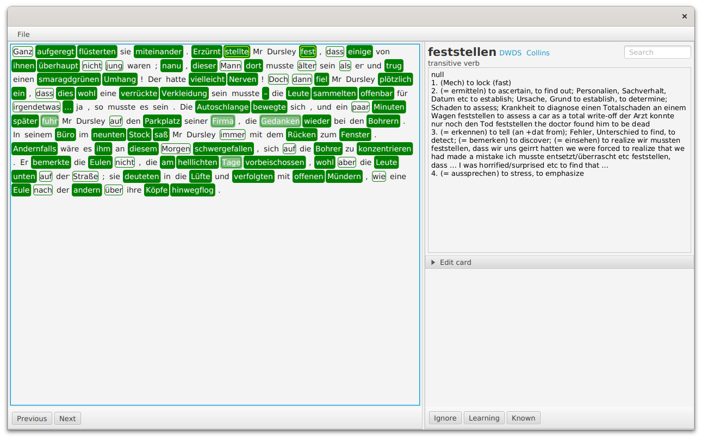

# LWT

LWT is a tool for improving one's German language knowledge through reading.
The program can load custom German texts and assist the user in reading by providing single-click
access to dictionaries, where the user may decide to add the word to their local 'Learning' collection,
or mark it as 'Known' or 'Ignored'. That given word will be color-coded from then on everywhere.
Collections also support adding metadata to each word, like gender, plural, notes, 
and an example sentence -- gender is automatically fetched from the dictionary for nouns, 
and the example sentence can be chosen as the one where the word is found in the text, greatly helping
later recalls.

The 'Learning' collection can then be exported to an Anki-compatible csv file for "offline" learning.

One advantage of the program over similar offerings is its support for compound words like separable verbs.
You are also not locked into it, every data is stored on your device.



## Technical description

The program is written in JavaFX and uses OpenNLP and UDPipe 1 for the language processing.
Categorized words are saved to a local SQLite database.

## Building, running

The program depends on the platform-dependent UDPipe 1 shared library, so please make sure that the necessary one found in the udpipe
folder is available on your platform's dynamic library path.

### Linux

```export LD_LIBRARY_PATH=.../bin-linux64/java/:$LD_LIBRARY_PATH```

### OSX

```export LD_LIBRARY_PATH=.../bin-macos/java/:$LD_LIBRARY_PATH```

### Windows

In PowerShell:
```$Env:Path = '.../bin-win64/java/;' + $Env:Path```


Then just issue:

`./gradlew run`